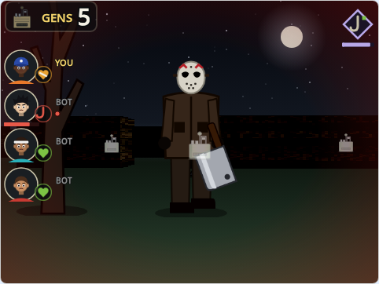

# Survive Until Daylight

A 3D asymmetric horror game (one killer, four survivors) in the style of Dead by Daylight, written in TypeScript with TextToScratch.

- **Solo**: play as a survivor or the killer; bots fill every other role.
- **Online** (Scratch cloud variables, up to 6 players): one player is the killer, everyone else is a survivor. Bots fill empty roles, humans who join mid-match take over a bot, and a bot takes over when someone leaves.
- **Survivors** repair 5 of the 7 generators (with timed skill checks: press SPACE in the white zone), power the exit gates, open one and escape. Throw down wooden pallets to stun the killer, vault them, heal and unhook each other.
- **A 7-minute dawn timer**: when it runs out the exit gates lock and everyone still inside is lost (the killer wins). Opening a gate starts a 90-second collapse.
- **Cutscenes** when you escape, when you're sacrificed, when the killer wins and when the survivors win.
- **The killer** hits survivors twice to down them, picks them up and hangs them on hooks (third hook, or a full hook timer, and they're gone). Kick generators and break pallets.
- **10 survivors** with their own perks and **3 masked killers** with their own power; your survivor is picked at random on every green flag.
- **2 random maps**: a two-story old house (with stairs) and a moonlit field with pallets, trees and a killer shack.

Controls: WASD move, arrow keys turn, hold E to interact, SPACE to act / attack (or click), Q for your perk or power, F self-heal (Self-Care), Z X C V B N quick chat online.

Touch screens: a joystick (push up/down to walk, left/right to turn), ACT, USE (hold), tap your perk icon for its power, drag anywhere else to look around. Toggle them on the main menu.

Regenerate the assets with `node scripts/maps.mjs && node scripts/art.mjs && node scripts/sfx.mjs`, then build with `npx tts build examples/survive-until-daylight`.
